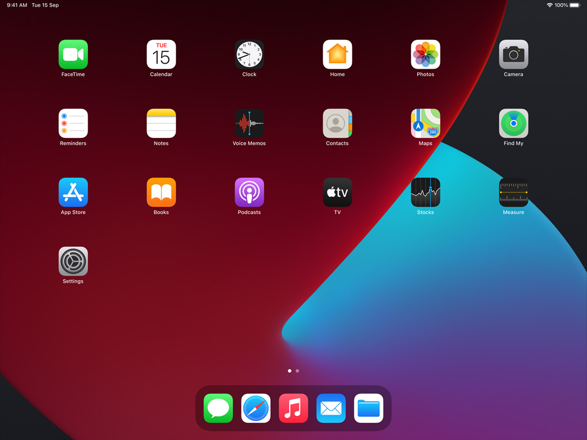

# My iOS

What I installed in my iOS

**Explanation**
   means Apple’s App
💻  means macOS available
     means iPadOS available

* [Books](#books)
* [Business](#business)
* [Developer Tools](#developer-tools)
* [Education](#education)
* [Entertainment](#entertainment)
* [Finace](#finance)
* [Food & Drink](#food--drink)
* [Graphics & Design](#graphics--design)
* [Health & Fitness](#health--fitness)
* [Lifestyle](#lifestyle)
* [Magazines & Newspapers](#magazines--newspapers)
* [Medical](#medical)
* [Music](#music)
* [Navigation](#navigation)
* [News](#news)
* [Photo & Video](#photo--video)
* [Productivity](#productivity)
* [Reference](#reference)
* [Games](#games)
* [Shopping](#shopping)
* [Social Networking](#social-networking)
* [Travel](#travel)
* [Utilities](#utilities)
* [Weather](#weather)
+ [iPadOS](#iPadOS-)
+ [macOS](#macOS-)

### Books
#### Apple Books  💻 
#### 微信读书 
#### Daily Dozen

### Business
#### 天眼查
#### 知识星球

### Developer Tools
#### Apple Developer  💻 
#### TestFlight  💻 
#### App Store Connect  
#### GitHub 

### Education
#### 流利说·英语
#### 极客时间 
#### 每日英语听力
#### BEAKER by THIX
#### NASA
#### WikiArt
#### 全历史
#### Aboboo-外语神器
#### 中华珍宝馆 
#### WWF Free Rivers
#### DailyArt
#### Meludia
#### Fretonomy
#### 国家数字图书馆
#### PlantNet

### Entertainment
#### Apple Podcasts  💻 
#### iTunes Remote  
#### Fluid Simulation
#### 开眼Eyepetizer
#### Time Capsule  
#### TikTok

### Finance
#### 招商银行
#### 动卡空间
#### PayPal
#### 个人所得税
#### DBS digibank

### Food & Drink
#### 菜谱大全
#### 下厨房

### Graphics & Design
#### Adobe Capture 

### Health & Fitness
#### Keep
#### Streaks
#### AutoSleep
#### MuscleWiki App

### Lifestyle
#### Alipay
#### 美团
#### 大众点评
#### 亿通行
#### 狮城助手
#### Xiaomi Home
#### VART
#### 每日故宫
#### 在艺
#### mars

### Magazines & Newspapers
#### iMuseum

### Medical
#### 3D Organon Anatomy Enterprise
#### 默沙东诊疗手册 

### Music
#### Monster Chords 
#### Pulse
#### Logic Remote  
#### Shazam  💻 
#### GarageBand  
#### SoundHound
#### Impulse
#### Spotify

#### Navigation
#### 高德地图
#### 百度地图

### News
#### Twitter
#### Reddit
#### 数字尾巴 DGtle

### Photo & Video
#### Final Cut Camera
#### Lightroom Photo & Video Editor
#### Instagram
#### VLC media player 💻 
#### Snapseed
#### Pixelmator Pro 💻 
#### Clips  
#### iMovie  💻 
#### YouTube 
#### PhotoScan by Google Photos
#### Imaging Edge Mobile 
#### Monitor+ 
#### Lux
#### DJI Fly
#### 快手
#### Darkroom 💻 

### Productivity
#### Evernote
#### 2Do
#### 盖得排行
#### Fantastical Calendar
#### Grammarly
#### Keynote  💻 
#### Numbers  💻 
#### Pages  💻 
#### Notion 💻 
#### Singpass
#### Obsidian 💻 

### Reference
#### Terminology Dictionary
#### Yunzhang calligraphy | 云章书法子弹
#### 腾讯翻译君
#### 欧路英语词典 Eudic  💻 
#### Merriam-Webster Dictionary 
#### Planit Live
#### Pantone Connect
#### 中国法律快查手册

### Games
#### Clash of Clans

### Shopping
#### 淘宝
#### 京东
#### 唯品会
#### 闲鱼
#### 转转
#### WEAR
#### 拼多多
#### Apple Store  
#### 多抓鱼
#### Carousell

### Social Networking
#### Telegram Messenger
#### QQ
#### Wechat
#### WhatsApp Messenger
#### Product Hunt
#### Signal
#### 即刻
#### 微博
#### 小红书
#### 乡音

### Travel
#### 铁路12306
#### Scoot Mobile
#### Air China
#### 携程旅行

### Utilities
#### 万年历
#### Google Authenticator
#### 中国联通
#### Shadowrocket 
#### Apple Support 
#### DuckDuckGo Privacy Browser
#### Reality Composer  💻 
#### Indoor Survey  
#### Cerulean
#### 夸克
#### Apple Music for Artists  
#### NiSi ND Calculator
#### Battle.net Authenticator
#### 1.1.1.1
#### 地质云

### Weather
#### ColorfulClouds Weather Pro
#### Windy.com
#### 莉景天气
#### QWeather

## [iPadOS ](https://github.com/asktao/iPadOS)
 -What I installed in my iPadOS
## [macOS 💻](https://github.com/asktao/macOS)
 -What I installed in my macOS

